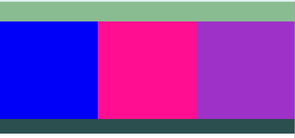

# 扯一扯圣杯布局和双飞翼布局
圣杯布局和双飞翼布局是前端新布局（flex、grid）出现之前最为合理的解决三列布局的布局方式。
效果就是两边的盒子固定宽度，中间自适应。

## 圣杯布局（HolyGrail Layout）
圣杯布局始于[In Search of the Holy Grail](https://alistapart.com/article/holygrail)。

样实现如下的效果：
 
`talk is cheap，show me the code`，直接上代码。  
html结构：
```html
<div class="header"></div>
<div class="container">
    <div class="middle"></div>
    <div class="left"></div>
    <div class="right"></div>
</div>
<div class="footer"></div>
```
关键样式：
```css
.container {
    overflow: hidden;
    padding: 0 200px; /* 创建一个中间自适应的容器 */
}

.middle {
    width: 100%;
    float: left; /* 顺势躺在里面 */
}

.left {
    width: 200px;
    float: left;        /* 紧跟在在middle之后 middle撑满了第一行，所以换行显示 */
    margin-left: -100%; /* 通过设置该属性让当前 回到第一行首 ，覆盖了middle的部分内容 */

    position: relative; /* 通过设置该属性让元素根据自己定位，向左侧偏移当前元素的宽度 */
    left: -200px;
}

.right {
    width: 200px;
    float: left;        /* 紧跟在在middle之后 middle撑满了第一行，left通过设置属性跑了，它占据了原来left的位置 */
    margin-left: -200px; /* 左外边距设置为负的元素的宽幅，让该元素回到了第一行的最后 */

    position: relative; /* 通过设置该属性让元素根据自己定位，向右侧偏移当前元素的宽度 */
    right: -200px;
}
```
### 存在的缺陷


## 参考
- [圣杯布局和双飞翼布局（前端面试必看）](http://www.jianshu.com/p/f9bcddb0e8b4)
- [In Search of the Holy Grail](https://alistapart.com/article/holygrail)