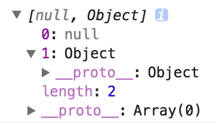

# 深浅拷贝

## 数组的浅拷贝
如果是数组，我们可以利用数组的一些方法比如：slice、concat 返回一个新数组的特性来实现拷贝。

> concat方法：  
> 用于连接两个或多个数组  
> 该方法不会改变现有的数组，而仅仅会返回被连接数组的一个副本。  
> 语法:  
> arrayObject.concat(arrayX,arrayX,......,arrayX)  
> arrayX可以使单个元素也可以是一个数组

> slice方法  
> 可从已有的数组中返回选定的元素。  
> 语法:  
> arrayObject.slice(start,end)  
> 返回一个新的数组  

比如：
```js
var arr = ['old', 1, true, null, undefined];

var new_arr = arr.concat();

new_arr[0] = 'new';

console.log(arr) // ["old", 1, true, null, undefined]
console.log(new_arr) // ["new", 1, true, null, undefined]
```

注意：  
但是如果嵌套了对象或者数组的话，就会发现改变新的值，老的也会发生变化。


不完全正确的深拷贝：
```js
var arr = ['old', 1, true, ['old1', 'old2'], {old:1}];
var new_arr = JSON.parse(JSON.stringify(arr));
console.log(new_arr);
```
这是一个非常粗暴的方法，先把对象转成字符串再转成对象。
但是面临`undefined`的时候会转成null，函数的时候会出现问题。
```js
var arr = [function(){
    console.log(a)
}, {
    b: function(){
        console.log(b)
    }
}]

var new_arr = JSON.parse(JSON.stringify(arr));

console.log(new_arr);
```


