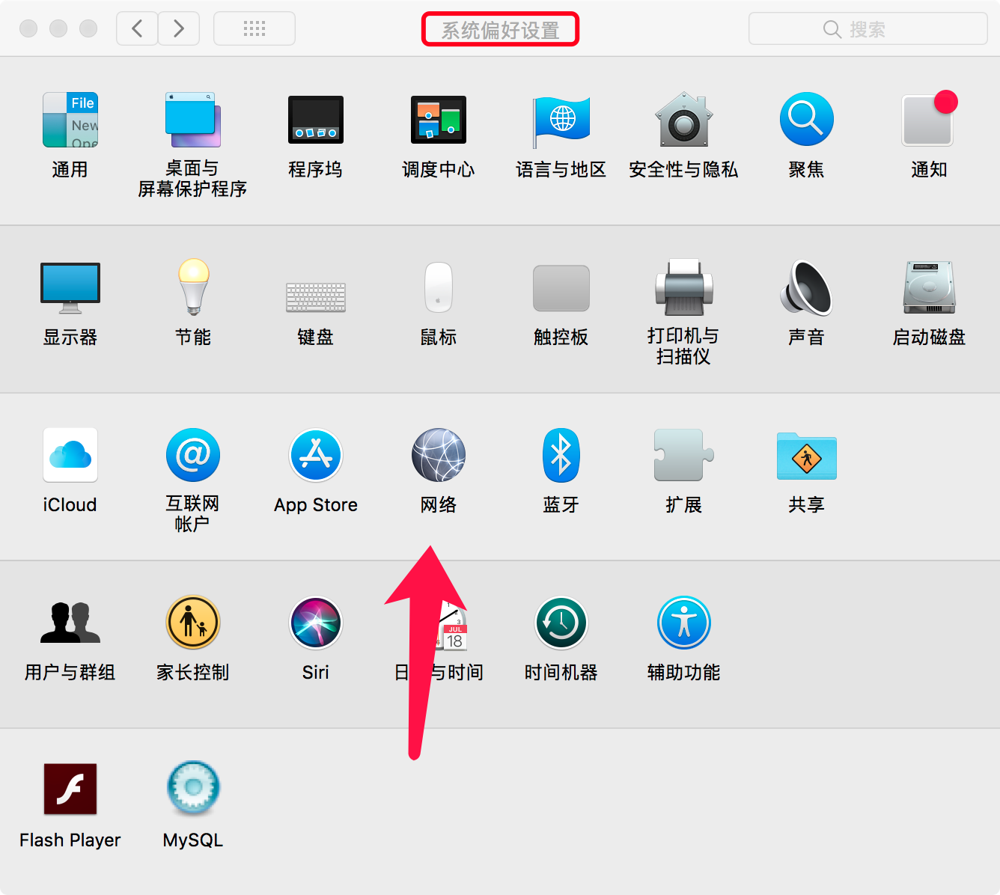
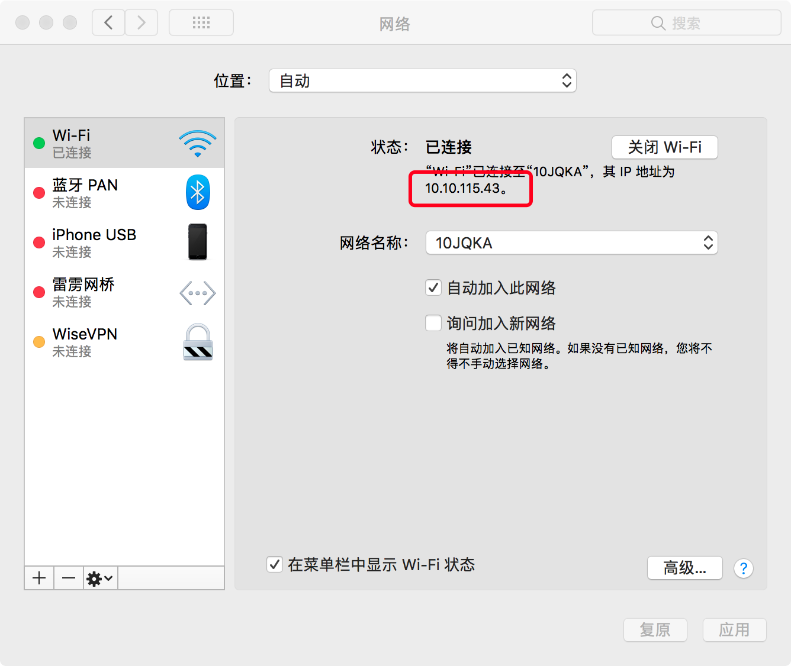
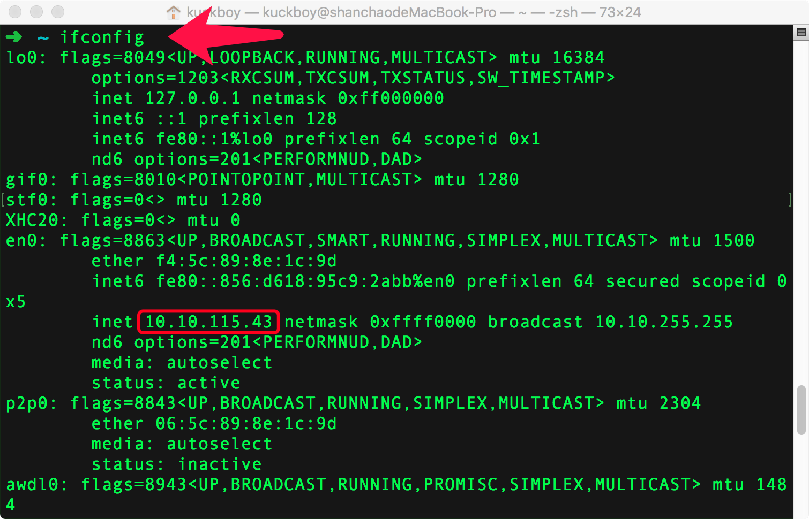
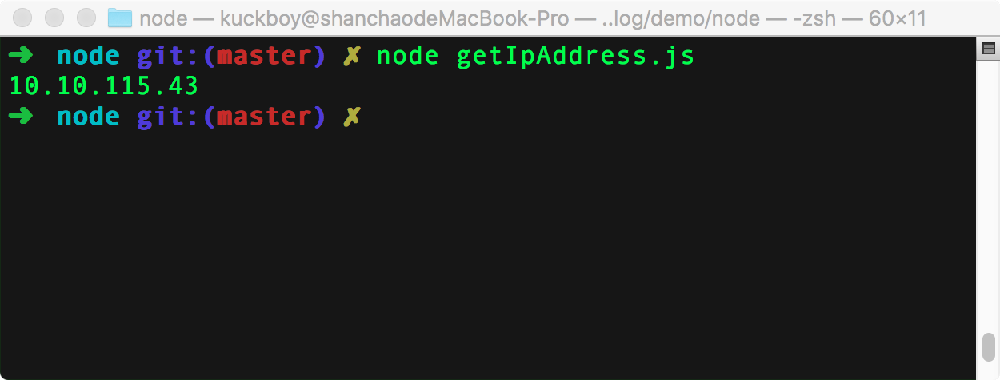
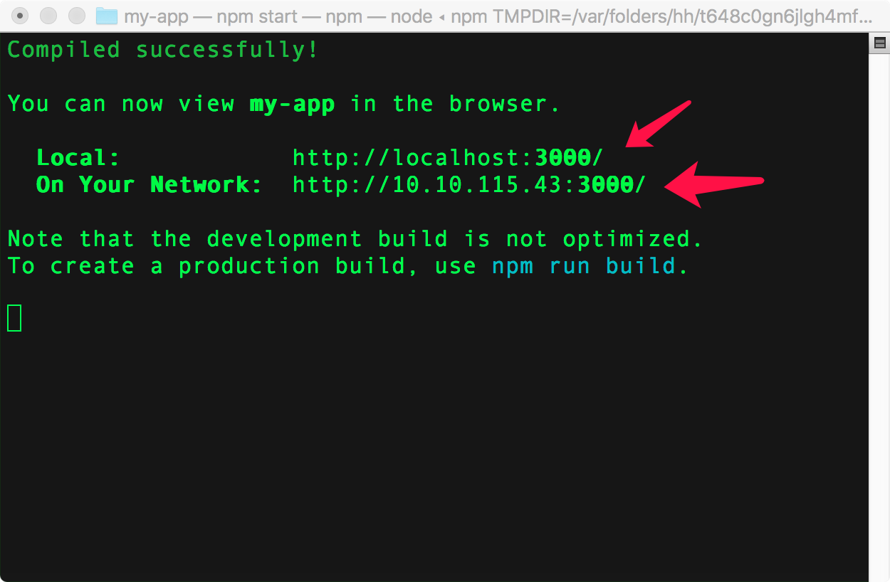

# 获取本机的ip地址
有的时候我们需要知道我们本地机器的ip地址。

前端项目大部分都是通过localhost:端口号来运行的，但是比如我们要写RN的时候，在安卓模拟器中的我们可能就不能直接使用`localhost`或`127.0.0.1`，使用的应该是局域网给我们动态分配的ip地址。

下面介绍两种三种方式获得动态分配的ip地址：

## 图形化获取
1. 打开偏好设置，点击网络


2. 红框圈起来的就是ip地址


## 命令行获取
1. 打开`terminal`  
输入`ifconfig`。注意不是`ipconfig`


## 程序获取
每次链接wifi的时候，我们的ip可能就会被重新分配，每次去走上面一遍可能会比较麻烦，有没有上面比较高级的方式获取呢。
1. 首先需要node环境
2. 在对应的程序下安装`address`包
```
npm init -y
npm install --save-dev
```
为了演示简单，单独写一个文件，例如：getIpAddress.js
```js
const address = require('address')
console.log(address.ip())
```
使用node运行。



有了上述的方法，我们就可以在程序启动的时候，告诉开发者（我们自己）当前的ip地址是多少，我们就能直接去模拟器中打开了。

`address`包还可以获取`IPv6`和`MAC`地址。详细查看 [address-npm](https://www.npmjs.com/package/address)