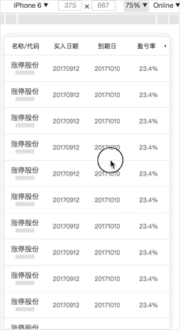

# 用网页实现移动端横向纵向列固定的表格
最终效果：



当页面横向滑动的时候，纵向上不能滚动。纵向滚动的时候，横向不能滚动。

## 分析
简单分析来说，页面就是上面一个`position:fixed;`在顶部，下面的列表的最左边一列`position-x:fixed`（哈哈这个属性当然是不存在的啦）。

从图上的演示来看右侧的横向滚动的是联动的，但是效果其实是一致的。那我们就看底下的列表。既可以左右，又可以上下，而且还要锁定一个方向。其实每次滚动的时候我们都只能操作一个元素，不知道大家能不能理解，就好比我们页面上有一个区域a有滚动条，当前的页面很长，也有滚动条，鼠标在区域a上滚动的时候页面是不动的，只有当区域a滚到底的时候，页面才会继续滚动。所以利用这个特性，我们创造一个叠加的滚动区域，一个`overflow-y:auto;`，一个`overflow-x:auto`。一个只能纵向滚动，一个只能横向滚动。

## html解释
html结构如下，左侧列表单独盛放（固定），右侧创造一个可以滚动的区域。
```html
<div class="table-body">
    <div class="table-body-left-fixed">
        <div class="table-td">
            <p>涨停股份</p>
            <p>888888</p>
        </div>
        <div class="table-td">
            <p>涨停股份</p>
            <p>888888</p>
        </div>
        ...
    </div>
    <div class="table-body-right">
        <div class="table-tr">
            <div class="table-td">20170912</div>
            <div class="table-td">20171010</div>
            <div class="table-td">23.4%</div>
            <div class="table-td">67.9%</div>
            <div class="table-td">-19.9%</div>
            <div class="table-td">103.90</div>
            <div class="table-td">9.12</div>
        </div>
        <div class="table-tr">
            <div class="table-td">20170912</div>
            <div class="table-td">20171010</div>
            <div class="table-td">23.4%</div>
            <div class="table-td">67.9%</div>
            <div class="table-td">-19.9%</div>
            <div class="table-td">103.90</div>
            <div class="table-td">9.12</div>
        </div>
        ...
    </div>
</div>
```
## css解释
`.table-body`设置为纵向滚动，`.table-body-right` 设置为横向滚动。  
`-webkit-overflow-scrolling: touch;` 是为了解决IOS滑动卡顿的问题。
```css
.table-body {
    position: absolute;
    top: 3.5rem;
    bottom: 0;
    left: 0;
    right: 0;
    overflow-y: auto;
    overflow-x: hidden;
    -webkit-overflow-scrolling: touch;
}
.table-body-right {
    position: absolute;
    left: 25vw;
    top: 0;
    right: 0;
    overflow-x: auto;
    -webkit-overflow-scrolling: touch;
}
```

## 联动，优化
上面的表头是简单版的列表，只有横向滚动。所以是非常easy的。

还有一个是联动，就是上面滚动的时候，得出左侧滚动距离`scrollLeft`，但是只是单纯去设置`thead[0].scrollLeft = e.target.scrollLeft;`（表头的左侧滚动距离等于目列表的左侧滚动距离），其实是有问题的，比如在高速的操作下（what...你是机器人么）。会出现你手停下来了，出现对不齐的问题。解决的办法就是把当前的操作加入异步队列中，这样所有的操作都会被执行下来。

以上就是最近写手机模板的收获。

> 要是所有人都能理解你，你得平庸成什么样