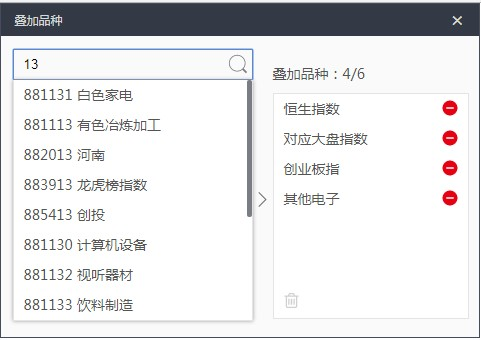

# vuejs 项目小结（一）
许久没有写vue了，前几天有人问我问题，概念都有些理不清楚了。。
项目快完成，总结一下。从最基础的开始，重现我遇到的问题和一些细节问题。

## 项目效果图




### 现实分析：
1. 上方一个搜索框，输入的时候获取数据。点击加入到右侧的列表中，叠加品种数量+1
2. 左侧默认有两个树状结构图，点击根展开收起，点击子节点，加入右侧列表。
3. 右侧点击删除按钮删除选项，选中数量-1
4. 超过6个的时候显示tip。

### 实现分析：
1. 把各个部分拆分成组件。
    1. topbar 表头组件
    2. searchbox 搜索框组件
    3. selectleftbox 左侧页面组件
    4. singletree 单支树状组件
    5. selectrightbox 右侧页面组件
    6. tip 组件
2. 状态跨多个组件 使用vuex来实现数据统一管理
3. 不使用图片图标 iconfont上下载svg图标
    
## 开始
使用vue-cli创建vuejs目录结构
```
npm install vue-cli -g
vue init webpack vue-test
cd vue-test
npm install
npm install vuex --save
npm run dev
```

### （一） 项目安装的时候，其实是不用路由的，但是手贱的我一不小心安装了，要如何不显示`/#/`这些难看的链接hash呢？
1. 最简单的方式就是去除入口文件man.js 中的router的引入和调用的地方
```js
// import router from './router'

new Vue({
    el: '#app',
    // router,
    store,
    template: '<App/>',
    components: { App }
})
```
2. 还有一种也是可以实现的，就是在/router/index.js 中修改路由模式
```js
import Vue from 'vue'
import Router from 'vue-router'
// import HelloWorld from '@/components/HelloWorld'

Vue.use(Router)

export default new Router({
    mode: 'history',
    routes: [
        {
            path: '/',
            // name: 'HelloWorld',
            // component: HelloWorld
        }
    ]
})
```
把模式改成`mode: 'history' ` ，在默认首页就不会出现hash值了，但是这可能不像想象中简单，还需要服务端配置。详细：[链接](https://router.vuejs.org/zh-cn/essentials/history-mode.html)。
所以还是用第一种吧。 2333

## （二）使用svg资源
先去http://www.iconfont.cn/找到类似图标按钮 不在乎大小和颜色。

添加入库。选完后点击购物车按钮，把所有的图标添加到项目中（没有可以新建一个）。到项目页面 点击编辑图标，可以修改图标的位置大小颜色。保存后下载svg。

把svg放置到项目assets文件夹（静态资源）下，组件中使用img标签引入svg文件。

还可以使用background属性引入。（奇怪，我开发的时候明明不能用，/(ㄒoㄒ)/~~ 现在居然可以了，还以为是个bug呢，算了，之后如果遇到再说）

我们引入svg难道就仅仅只是当做背景使用的吗？当然不是！！！

应该还还可以直接直接控制颜色的变化，但是试了半天没效果，发现了其他引入的方式。
```
// fn1
<object :data="addBtn" type=""></object>

import addBtn from '@/assets/add.svg’

// fn2
<object :data=“require(./assets/add,svg)" type=""></object>
```

## （三）组件的编写
组件是vue的核新内容，vue推崇的是全部使用组件的方式构建页面。
下面是tip组件的基本内容。
```js
<template>
    <div class="tip">
        
        <span>{{message}}</span>
    </div>
</template>

<script>
import Store from '@/store'

export default {
    props: {
        msg: {
            type: String,
            default: ''
        }
    },
    data () {
        return {
            message: this.msg
        }
    }
}
</script>

<style scoped>
/* 样式 */
</style>
```
组件基本功能就是传入tip文字，显示文字。就是这么简单，props中定义了传参的参数的类型和默认值，可以直接使用this.参数来调用。但是我们一般不直接使用参数，而是把参数赋值给当前组件的一个变量，因为参数的内容是不可更改的，所以防止出现失误，所以赋值之后，使用被赋值的变量进行操作。

## （四）跃动的组件。。
运行实例我们可以发现tip组件的是有动画效果的，从上方落下渐显，过1.5秒后，当前位置落下渐逝，效果是不是很酷。

我们来分析一下：

其实我们主要使用的是vue的内置组件<transition>

参数name=“fall”  fall是我们自己定义的一个动画的名称。同时我们要在样式中增加，如：
```css
.fall-enter {
    opacity: 0;
    transform: translateY(-50px);
}
.fall-enter-active {
    transition: all .5s;
}
.fall-leave {
}
.fall-leave-active {
    transition: all .5s;
    transform: translateY(50px);
    opacity: 0;
}
```
.name-enter 代表进入之前的状态  
.name-enter-active 代表进入的状态  
.name-leave 离开之前的状态  
.name-leave-active 离开的状态  


借用一张图片说明，这个是一个渐显到渐逝的过程。绝大部分v-enter-active（进入的状态）和 v-leave（离开之前的状态）其实是一样的，所以v-leave就不用写了，只要控制好其他的三个状态就可以了。这里面需要用到transition属性的地方是active（激活）的时候。为什么是这样呢？你可以审查一下元素发现，内置组件`<transition>`的主要作用就是把这四个状态（类）按照约定好的触发状态添加和删除。至此我们动画就可以动起来了。

拓展（其他参数）：
* name - string，用于自动生成 CSS 过渡类名。例如：name: 'fade' 将自动拓展为.fade-enter，.fade-enter-active等。默认类名为 "v"
* appear - boolean，是否在初始渲染时使用过渡。默认为 false。
* css - boolean，是否使用 CSS 过渡类。默认为 true。如果设置为 false，将只通过组件事件触发注册的 JavaScript 钩子。
* type - string，指定过渡事件类型，侦听过渡何时结束。有效值为 "transition" 和 "animation"。默认 Vue.js 将自动检测出持续时间长的为过渡事件类型。
* mode - string，控制离开/进入的过渡时间序列。有效的模式有 "out-in" 和 "in-out"；默认同时生效。
还有一些事件，可以在动画发生之前和之后触发，让动画的控制更加细节。

[官网详细说明](https://cn.vuejs.org/v2/api/#transition)

## （五）vuex统一的数据管理
安装完vuex之后，项目比较简单，所以我们在入门文件main.js同级建了一个store.js的文件。
```js
import Vue from 'vue'
import Vuex from 'vuex'

Vue.use(Vuex)
export default new Vuex.Store({
    state: {
        num:1
    },
    mutations: {
    }
})
```
main.js 引入和把store中的内容作为实例的参数传入。
```js
import store from './store’
new Vue({
    el: '#app',
    store,
    template: '<App/>',
    components: { App }
})
```
组件中使用store可以通过
```js
import Store from '@/store’
```
来使用store中的数据，但这样是有点多余的，因为Vuex 通过 store 选项，提供了一种机制将状态从根组件“注入”到每一个子组件中，可以直接在组件中使用$store.state.num 获取到num的值。

Vuex.store中的：  
state 用于数据（状态）的存储。 Vuex 使用单一状态树。我们是不能操作state中的数据的。

mutation 是唯一能操作修改state的方法。我们通过调用我们自定义的mutation方法，修改state。

getter 用于获取数据，虽然state不能修改，但是获取数据state是可以的，getter返回的数据是可以定义一些逻辑在里面的。例如筛选出num大于0的数据。

action 类似于mutation，mutation必须是同步函数，虽说如此但是我tip的显示隐藏状态是放在mutation中设了一个定时器（异步）去设置隐藏状态，也是可以的。在下文的时候修改一下。

Module 是防止store太大，不便管理而设置的。

这次我们拿右侧选择框来做演示。  
右侧的选中数据来自左侧选择框中点击添加而来，首先数据被添加到store中，右侧发现数据更新了，立即渲染新的数据。  
如何设置呢？
```js
// data
selectList: this.$store.state.selectData,
```
这样就能拿到数据进行渲染啦。  
点击左侧添加到右侧。  
同理我们设置了
```js
// data
isShowDelAllBtn: this.$store.state.selectData.length > 0
```
用于渲染当有数据的时候就显示删除全部的按钮，但是失效了？？？  
渲染的数据一旦被处理之后返回就不再有“数据双向绑定”的特性了，个人猜测。 

所以vuex给出一个解决方案：  
mapState 辅助函数  
当一个组件需要获取多个状态时候，将这些状态都声明为计算属性会有些重复和冗余。为了解决这个问题，我们可以使用 mapState 辅助函数帮助我们生成计算属性  
直接贴代码：
```js
import { mapState } from  ‘vuex'
// ...
computed: mapState({
    isShowDelAllBtn: state => state.selectData.length > 0
})
```
mapstate中定义的计算属性isShowDelAllBtn直接可以在组件中使用 默认带一个参数state，可以直接使用state中的方法和属性

## 总结
先分享这么几点，好久没碰了，之后加深理解之后不断优化。加油！ happy hacking！


