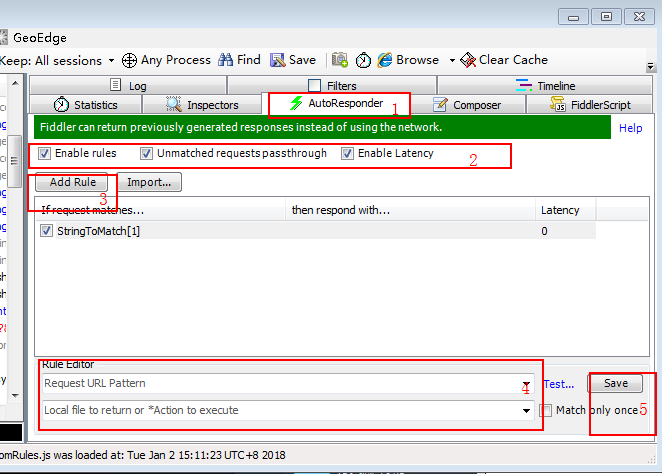

# XSS攻击
XSS攻击全称跨站脚本攻击，常见的就是攻击者把恶意代码植入到用户页面中。

在XSS攻击中，一般有三个角色参与：攻击者、目标服务器、受害者的浏览器。

由于服务端没有对用户的输入做安全方面的验证，攻击者就通过输入的方式，夹带一些恶意的html脚本代码（包括html, css, js）。


## XSS攻击的分类
1. 反射型XSS（Reflected XSS）

反射型XSS，又称非持久型XSS。之所以称为反射型XSS，则是因为这种攻击方式的注入代码是从目标服务器通过错误信息、搜索结果等等方式“反射”回来的。而称为非持久型XSS，则是因为这种攻击方式具有一次性。`攻击者通过电子邮件等方式将包含注入脚本的恶意链接发送给受害者，当受害者点击该链接时，注入脚本被传输到目标服务器上，然后服务器将注入脚本“反射”到受害者的浏览器上，从而在该浏览器上执行了这段脚本。`

比如攻击者将如下链接发送给受害者：
```
http://www.targetserver.com/search.asp?input=<script>alert(document.cookie);</script>
```
当受害者点击这个链接的时候，注入的脚本被当作搜索的关键词发送到目标服务器的search.asp页面中，则在搜索结果的返回页面中，这段脚本将被当作搜索的关键词而嵌入（服务端渲染）。这样，当用户得到搜索结果页面后，这段脚本也得到了执行。这就是反射型XSS攻击的原理，可以看到，攻击者巧妙地通过反射型XSS的攻击方式，达到了在受害者的浏览器上执行脚本的目的。由于代码注入的是一个动态产生的页面而不是永久的页面，因此这种攻击方式只在点击链接的时候才产生作用，这也是它被称为非持久型XSS的原因。  
危害在用户查询的时候，可以实现把用户的cookie信息发送给攻击者

情况二，通过渲染页面进行攻击：
比如攻击者将如下链接发送给受害者：
```
http://www.targetserver.com/response-xss.html?input=<style>body{background:red;}</style>
```
需要渲染input中的内容到页面中，上面的会修改页面的背景色。  
<s>渲染模式是没办法获取用户cookie信息的（个人测试得出的结论，有异议敬请斧正）。</s>  
如果一个input的value属性值是
```
琅琊榜" onclick="javascript:alert('handsome boy')
```
就可能出现
```html
<input type="text" value="琅琊榜" onclick="javascript:alert('handsome boy')">
```
点击输入框爆炸。。

2. 存储型XSS（Stored XSS）

存储型XSS，又称持久型XSS，他和反射型XSS最大的不同就是，攻击脚本将被永久地存放在目标服务器的数据库和文件中。这种攻击多见于论坛，攻击者在发帖的过程中，将恶意脚本连同正常信息一起注入到帖子的内容之中。随着帖子被论坛服务器存储下来，恶意脚本也永久地被存放在论坛服务器的后端存储器中。当其它用户浏览这个被注入了恶意脚本的帖子的时候，恶意脚本则会在他们的浏览器中得到执行，从而受到了攻击。

可以看到，存储型XSS的攻击方式能够将恶意代码永久地嵌入一个页面当中，所有访问这个页面的用户都将成为受害者。如果我们能够谨慎对待不明链接，那么反射型的XSS攻击将没有多大作为，而存储型XSS则不同，由于它注入的往往是一些我们所信任的页面，因此无论我们多么小心，都难免会受到攻击。可以说，存储型XSS更具有隐蔽性，带来的危害也更大，除非服务器能完全阻止注入，否则任何人都很有可能受到攻击。

1. 发一篇文章，里面包含了恶意脚本
```
今天天气不错啊！<script>alert('handsome boy')</script>
```
2. 后端没有对文章进行过滤，直接保存文章内容到数据库。

3. 当其他看这篇文章的时候，包含的恶意脚本就会执行。

PS：因为大部分文章是保存整个HTML内容的，前端显示时候也不做过滤，就极可能出现这种情况。

`结论：`

后端尽可能对提交数据做过滤，在场景需求而不过滤的情况下，前端就需要做些处理了。

开发安全措施：

1. 首要是服务端要进行过滤，因为前端的校验可以被绕过。

2. 当服务端不校验时候，前端要以各种方式过滤里面可能的恶意脚本，例如script标签，将特殊字符转换成HTML编码。

3. 跨站请求伪造

跨站请求伪造（Cross-SiteRequest Forgery，CSRF），作为OWASP组织的2007年提出十大安全漏洞第五，它也属于XSS攻击的一种衍生。所谓跨站请求伪造，就是攻击者利用XSS注入攻击的方式，注入一段脚本，而当受害者的浏览器运行这段脚本时，脚本伪造受害者发送了一个合法请求。比如我们注入如下的HTML代码：

```html

```

假如上面的代码中所访问的是某个银行网站的转账服务，则当受害者的浏览器运行这段脚本时，就会向攻击者指定的账户（示例的123456）执行转账操作。由于这个转账请求是在受害者的浏览器中运行的，因此浏览器也会自动将受害者的Cookie信息一并发送。这样，发送的请求就好像是受害者自己发送的一样，银行网站也将认可这个请求的合法性，攻击者也就达到了伪造请求的目的。

类似操作：
攻击者提供一个免费的wifi，连接之后，在本地开启fiddler这种抓包工具，这类工具不仅能获取到被攻击者的所有信息，还能修改用户访问的内容，模拟用户在被害者设备发起请求。


4. 注入恶意软件

除了直接注入恶意脚本以外，通过XSS攻击，攻击者也可以很方便地在脚本中引入一些恶意软件，比如病毒、木马、蠕虫等等。例如，攻击者可以在某个自己建立的页面上放置一些恶意软件，然后用XSS注入的方式，插入一段引用该页面的脚本。这样当受害者的浏览器执行这段脚本的时候，就会自动访问放置了恶意软件的页面，从而受到这些恶意软件的感染。

利用XSS注入恶意软件的方式，攻击者可以很方便地在互联网上传播病毒、木马和蠕虫，通过这种途径，攻击者就可以通过这些病毒、木马和蠕虫，进一步地对受害者的主机发动攻击。目前，互联网上的“挂马”现象非常普遍，而XSS注入的出现也无疑给“挂马”的攻击者指明了又一个新的方向。通过传播这些木马，窃取合法用户的敏感信息，不少非法攻击者也逐渐将这一过程产业化，经常可以见到以信封方式批量兜售账号密码的现象。这也给许多正常的网络用户造成了许多无法挽回的巨大损失，造成的危害也很大。

## XSS的预防
在前面的文章中，我们具体介绍了各种XSS攻击的原理和方式。可以看出，XSS是一种覆盖面很广，隐蔽性很高，危害也非常大的网络应用安全漏洞。除非网站服务器完全不存在XSS漏洞，否则就会给攻击者们留下空子。因此，如何在Web应用程序的开发过程中对XSS漏洞进行预防，是所有网站开发人员所必须注意的重中之重。下面我们介绍几种常用的XSS预防措施。

1. 输入检测

对用户的所有输入数据进行检测，比如过滤其中的“<”、“>”、“/”等可能导致脚本注入的特殊字符，或者过滤“script”、“javascript”等脚本关键字，或者对输入数据的长度进行限制等等。同时，我们也要考虑用户可能绕开ASCII码，使用十六进行编码如“<</span>”（“<”）、“>”（“>”）等来输入脚本。因此，对用户输入的十六进制编码，我们也要进行相应的过滤。只要开发人员能够严格检测每一处交互点，保证对所有用户可能的输入都进行检测和XSS过滤，就能够有效地阻止XSS攻击。

2. 输出编码

通过前面对XSS攻击的分析，我们可以看到，之所以会产生XSS攻击，就是因为Web应用程序将用户的输入直接嵌入到某个页面当中，作为该页面的HTML代码的一部分。因此，当Web应用程序将用户的输入数据输出到目标页面中时，只要用HtmlEncoder等工具先对这些数据进行编码，然后再输出到目标页面中。这样，如果用户输入一些HTML的脚本，也会被当成普通的文字，而不会成为目标页面HTML代码的一部分得到执行。

3. Cookie防盗

利用XSS攻击，攻击者可以很方便地窃取到合法用户的Cookie信息。因此，对于网站来说，不能在Cookie信息中存放太多敏感信息，也不能将Cookie作为身份认证的唯一标识，等等。因此，对于Cookie，我们可以采取以下的措施。首先，我们要尽可能地避免在Cookie中泄露隐私，如用户名、密码等；其次，我们可以将Cookie信息用MD5等Hash算法进行多次散列后存放；再次，为了防止重放攻击，我们也可以将Cookie和IP进行绑定，这样也可以阻止攻击者冒充正常用户的身份。

4. 严格限制URL访问

攻击者使用XSS攻击，通常都要借助于自己指定的网站页面，比如用它来记录敏感信息、在该页面上“挂马”等等。因此，在页面的脚本代码执行过程中，只要我们严格限制其访问的URL，比如只允许脚本代码访问本网站的URL等方式，就可以避免脚本的执行链接到其它可能是攻击者指定的页面上。

5. 用户注意事项

作为一名普通的网络用户，在XSS攻击的预防上总体处在被动的地位。但是我们也可以通过采取一些措施来尽可能地避免受到XSS攻击。首先，我们不要轻易相信电子邮件或者网页中的不明链接，这些链接很有可能引导反射型XSS攻击或者使我们访问到一些不安全的网页。其次，我们在不必要的时候可以禁用脚本功能，这样XSS注入的脚本就无法得到运行。再次，我们也可以使用一些安全的浏览器上网，有的浏览器提供XSS过滤功能，会提示页面中可能发生的XSS注入并将其阻挡下来。

## XSS的漏洞检测

1. 黑盒测试
所谓黑盒测试，就是在不知道系统的代码和运行状态的条件下，对系统进行的测试。在对XSS漏洞的检测中，我们可以模拟黑客的攻击手段，在所有可能的数据输入接口处，尝试进行一些XSS注入。通过观察注入后的引用这些数据的页面，看其是否出现被注入的现象，即可确实是否存在XSS漏洞。比如我们可以用下面所列的一些脚本来尝试XSS注入：
```html
1. 在HTML标签中输出
<script>alert(document.cookie)</script>
e.g.
<div><script>alert(document.cookie)</script></div>

2. 在HTML属性中输出
"><script>alert(document.cookie)</script><"
e.g.
<div name=""><script>alert(document.cookie)</script><""></div>
e.g.


http://xxx.com/yyy.png" onerror="alert('XSS')
e.g.


3. 在<script>标签中输出
";alert(document.cookie);//
e.g. 
<script>
var x = "";alert(document.cookie);//";
</script>

4. 在事件中输出
'');alert(document.cookie
e.g.
<a href="funcA('');alert(document.cookie)"></a>

5. 在CSS中输出（仅低版本 IE 有效）
body {background-image:url("javascript:alert('XSS')");}
body {background-image:expression(alert('xss'));}
```

如果在打开那些引用了该输入数据的页面时，弹出对话框显示信息，则可以确定该数据输入时有可能导致XSS注入，从而确定了XSS漏洞的位置。

2. 静态分析

XSS漏洞静态分析方法属于白盒测试方法的一种，它通过对Web应用的代码进行分析，从而发现其中可能存在的问题。通常来说，静态分析技术只是对代码进行一些简单的扫描，找到其中有可能导致XSS注入的地方，将其报告给我们。

比如在Web应用的代码中可能存在一些读入数据的API，如Request.QueryString()，$_GET等，如果存在这些API，则表示可能引入XSS的注入。通过静态分析工具，我们可以很容易发现所有这些读入数据的API，从而详细检查每一个数据输入点是否进行了XSS注入的过滤。可以看到，静态分析的方法，只是帮助我们定位XSS漏洞的可能位置，由于静态分析工具难以判定是否对输入数据进行过XSS过滤，因此还是需要我们手动地进行检查，从而确保不存在XSS漏洞。

3. 数据流分析

XSS漏洞之所以产生，根本原因在于不安全的数据流，使得用户的输入数据被直接嵌入到某些页面中。比如PHP中的echo语句，就能够将一些数据直接添加为HTML页面的一部分，如果这个数据是用户注入了XSS脚本的数据，则会导致产生XSS攻击。因此，数据流分析的主要思想就是使用一些模型或者工具，分析Web应用程序代码中的数据传输情况，从而发现其中存在的问题。比如，我们可以将用户的输入数据所存储的变量打上污点标记，通过对数据流和变量类型的分析，逐步标记所有引用了污点变量的中间变量，最后通过观察输出到页面中的变量数据是否存在污点，来判断是否可能产生XSS漏洞。


## 参考
- [[web安全]XSS可能发生的场景及解决方法](http://blog.csdn.net/hitwangpeng/article/details/45503465)
- [前端安全之XSS攻击](https://www.cnblogs.com/lovesong/p/5199623.html)
- [Cross-Site Scripting(XSS): 跨站脚本攻击介绍](http://blog.csdn.net/yefan2222/article/details/7091863)