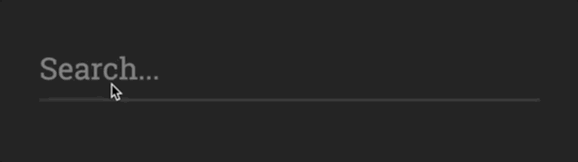

# 【翻译】给文本输入框增加下边框效果（Text Input with Expanding Bottom Border）
文本翻译自 [css-tricks](https://css-tricks.com/) 网站的 [Text Input with Expanding Bottom Border](https://css-tricks.com/text-input-expanding-bottom-border/) 一文。翻译有误，期待斧正。

## 正文
Petr Gazarov在他的文章`Text input highlight, TripAdvisor style`中使用了一个漂亮的小设计。



这是一个花招，在文本框下面实现这样的伸缩效果是不能实现的，所以Petr使用了span标签来同步内容，表现上想是它有一个边框一样。整个过程像是一个响应式的组件。

如果你愿意使用`<span contenteditable>`，你可以在CSS中完成所有的事情！

```html
<style>
div {
    padding: 0.4rem 0;
    border-bottom: 4px solid #383838;
    width: 90vw;
}
span {
    position: relative;
    bottom: -11px;
    color: white;
    display: inline-block;
    padding: 0.4rem 0;
    border-bottom: 4px solid #D5BA5E;
    outline: 0;
}
</style>
<body>
    <div>
        <span contenteditable="true">Content</span>
    </div>
</body>
```
因为你没有使用input，所以`placeholder`（占位符）也就无效了。

## 拓展
`contenteditable`的兼容ie6+

`contenteditable`是有继承性（inherit）的。如果没有设置该属性，其默认值继承自父元素。

`contenteditable=true`在黏贴的时候会把html标签给带上，所以显示出原来的感觉和富文本编辑差不多。

在[张鑫旭-小tip: 如何让contenteditable元素只能输入纯文本](http://www.zhangxinxu.com/wordpress/2016/01/contenteditable-plaintext-only/) 一文中提到了
```css
contenteditable=""
contenteditable="events"
contenteditable="caret"
contenteditable="plaintext-only"
contenteditable="true"
contenteditable="false"
```

`contenteditable="plaintext-only"` 黏贴是纯文本的内容。但也仅限于Chrome之流的浏览器。

## 收获
- 认识到自己对于样式的了解还不够
- 可以看看W3C之后的规范和草案

## 参考
- [https://css-tricks.com/text-input-expanding-bottom-border/](https://css-tricks.com/text-input-expanding-bottom-border/)
- [小tip: 如何让contenteditable元素只能输入纯文本](http://www.zhangxinxu.com/wordpress/2016/01/contenteditable-plaintext-only/)
- [contenteditable - HTML | MDN](https://developer.mozilla.org/zh-CN/docs/Web/HTML/Global_attributes/contenteditable)